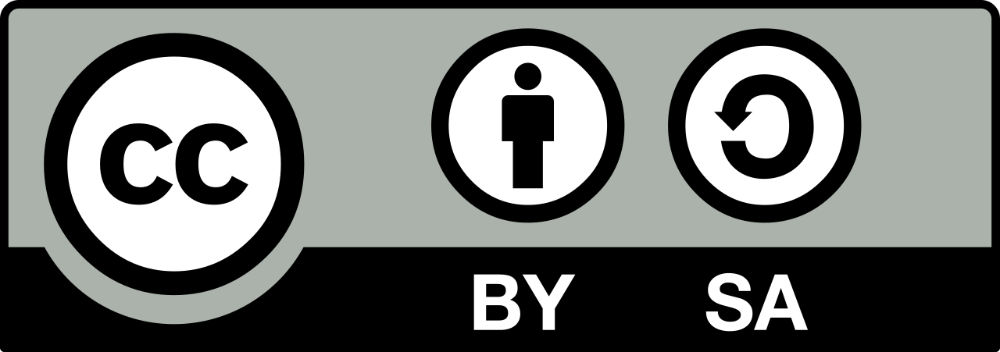

English / <a href="https://github.com/4ioskd/my-Stars-lists/blob/main/README-JA.md" rel="noopener noreferrer">日本語</a>
# My Star lists on Github
 
I would like to share my Star lists to boost the social diversity, eliminate the opportunity differentials and reconfirm a importance of Digital commons.(By the way, what is "Digital commons"? See https://en.wikipedia.org/wiki/Digital_commons_(economics) )  
<b>We are different, not divided.</b>  

# Star lists
- <a href="https://github.com/stars/4ioskd/lists/accessibility" rel="noopener noreferrer">Accessbility</a> 
- <a href="https://github.com/stars/4ioskd/lists/black-lives-matter" rel="noopener noreferrer">Black Lives Matter</a> 
- <a href="https://github.com/stars/4ioskd/lists/community" rel="noopener noreferrer">Community</a> 
- <a href="https://github.com/stars/4ioskd/lists/social-network" rel="noopener noreferrer">Social Network</a> 
- <a href="https://github.com/stars/4ioskd/lists/design-art" rel="noopener noreferrer">Design & Art</a> 
- <a href="https://github.com/stars/4ioskd/lists/education" rel="noopener noreferrer">Education</a> 
- <a href="https://github.com/stars/4ioskd/lists/empowering-women" rel="noopener noreferrer">Empowering Women</a> 
- <a href="https://github.com/stars/4ioskd/lists/funding-job" rel="noopener noreferrer">Funding & Job</a> 
- <a href="https://github.com/stars/4ioskd/lists/learning-material" rel="noopener noreferrer">Learning Material</a> 
- <a href="https://github.com/stars/4ioskd/lists/lgbtqia" rel="noopener noreferrer">LGBTQIA</a> 
- <a href="https://github.com/stars/4ioskd/lists/public-domain" rel="noopener noreferrer">Public Domain</a>  
...new lists will be added soon?

# License
CC-BY-SA-4.0 
(A detailed discription of this license is... https://creativecommons.org/licenses/by-sa/4.0/)  
</a>
